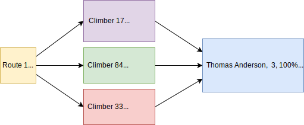

# Mountain Project Data Analyzer

Find other Mountain Project users with similar tick lists.



### Setup

Use any of the following to install dependencies.

* Create a virtual environment and install dependencies from [requirements.txt](requirements.txt). This will use your current version of Python.
```shell script
python -m venv venv
source venv/bin/activate
pip install -r requirements.txt
```

* Create virtual environment and install dependencies from [Pipfile](Pipfile), or [Pipfile.lock](Pipfile.lock) if present. If installed, [pyenv](https://github.com/mkorangestripe/linux/blob/master/linux-notes/python-management.md#pyenv) will prompt you to install the specified version of Python if not already.
```shell script
pipenv install
```

* With Anaconda installed, create virtual environment, install dependencies in [mntproj_py3.12.7.yaml](mntproj_py3.12.7.yaml), and install Python 3.12.7
```shell script
conda env create -n mntproj_py3.12.7 -f mntproj_py3.12.7.yaml python=3.12.7
```

See [Package management](#package-management) below for further details.

### Run as an API

Activate virtual env:
```shell script
source venv/bin/activate         # using venv
pipenv shell                     # using pipenv
conda activate mntproj_py3.12.7  # using Anaconda
```

Change to the app directory:
```shell script
cd mntproj-data-app
```

Start using Flask:
```shell script
python app.py
```

Start using Gunicorn:  
Set the number of workers to (number of CPU cores x 2) + 1

```shell script
# For shorter runs:
gunicorn -w 3 -b 0.0.0.0:8000 --timeout 1800 app:app

# Run in background:
nohup gunicorn -w 3 -b 0.0.0.0:8000 --timeout 1800 app:app >/var/log/mntproj/gunicorn.log 2>&1 <&- &
```

View in a browser running with Flask:
[http://127.0.0.1:5000/](http://127.0.0.1:5000/)  
View in a browser running with Gunicorn:
[http://127.0.0.1:8000/](http://127.0.0.1:8000/)

The UID/name can be submitted on the page or with a query string.

If the port is already in use, check for previously started processes and kill the ppid, 49690 here:
```shell script
lsof -ni :8000

ps -ef | grep 49690

kill 49690
```

### Run as a script

Create mntproj_user_ids.yaml and add UID/names, example:
```yaml
thomas-anderson: 123456789
suzy-bishop: 000000002
```

Example usage:
```shell script
python scrape_mntproj.py thomas-anderson

# Use cached data for routes checked within the last 60 min:
python scrape_mntproj.py thomas-anderson 60
```

Options:  
-n Try to use cached user's csv file

### Logs

The log location is set in [constants.py](mntproj-data-app/constants.py)

Tail the log files to see progress while running:
```shell script
tail -f logs/app.log
tail -f logs/compare_csv.log
tail -f logs/scrape_mntproj.log
```

### Notes

This calls a Mountain Project API, you may receive HTTP response status code 429 (Too Many Requests) based on the rate limiting. This is why the get requests are not done in parallel.

You can use [compare_csv.py](mntproj-data-app/compare_csv.py) to compare two Mountain Project tick lists with each other.

### Bugs

Ocassionally the percent for the user being analyzed will be well over 100%. This should always be exactly 100%.

### Python versions

On macOS, you can use [Homebrew](https://brew.sh) to install anaconda, miniconda, or pyenv and inturn various version of Python.

[Homebrew on macOS examples](https://github.com/mkorangestripe/linux/blob/master/linux-notes/package-management.md#homebrew-on-macos)

[Python version and package management examples](https://github.com/mkorangestripe/linux/blob/master/linux-notes/python-management.md)
