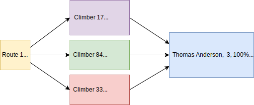

# Mountain Project Data Analyzer

Find other Mountain Project users with similar tick lists.



### Run as an API

Activate virtual env:
```shell script
pipenv shell                          # using pipenv
conda activate envs/mntproj_py3.12.7  # using Anaconda
```

Start using Flask:
```shell script
python app
```

Start using Gunicorn:  
Set the number of workers to (number of CPU cores x 2) + 1
```shell script
gunicorn -w 3 -b 0.0.0.0:8000 --timeout 1800 app:app
nohup gunicorn -w 3 -b 0.0.0.0:8000 --timeout 1800 app:app >/var/log/mntproj/gunicorn.log 2>&1 <&- &

```

View in a browser running with Flask:
http://127.0.0.1:5000/  
View in a browser running with Gunicorn:
http://127.0.0.1:8000/

### Run as a script

Example usage, 2nd arg is cached data limit in minutes:
```shell script
python scrape_mntproj.py thomas-anderson
python scrape_mntproj.py thomas-anderson 60
```

Options:  
-n Try to use cached user's csv file

The UID/name must be present in [mntproj_user_ids.yaml](mntproj_user_ids.yaml), example:
```yaml
thomas-anderson: 123456789
suzy-bishop: 000000002
```

### Setup

```shell script
cd mntproj-compare
```

Create virtual env and install dependencies:
```shell script
pipenv install
```

Create tick list directory and cache file:
```shell script
echo '{}' > all_route_ticks.json
mkdir user_tick_csv
```

Create log directory:
```shell script
sudo mkdir /var/log/mntproj
sudo chown YOUR_USER /var/log/mntproj
```

### Notes

This calls a Mountain Project API, you may receive HTTP response status code 429 (Too Many Requests) based on the rate limiting.

Compare two Mountain Project tick lists: [compare_csv.py](compare_csv.py)

To do items: [to-do.txt](to-do.txt)
